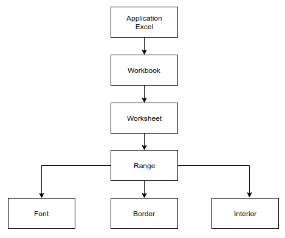

@title[Objects]

@snap[north-west]
  @size[2.5em](Objects)
@snapend

- **Objects** - Mapper, Ark, Celler
- **Methods** - Den handling du vil udføre
- **Properties** - Egenskaber
- **Values** - Den værdi du angiver

---
@title[Objects Syntax]

@snap[west sidebar]
  Object Hierarchy
@snapend

---?code=code/grund&lang=vb
@title[Objects Code]
@[1-8](Struktur)
@[9-16](Kode)
